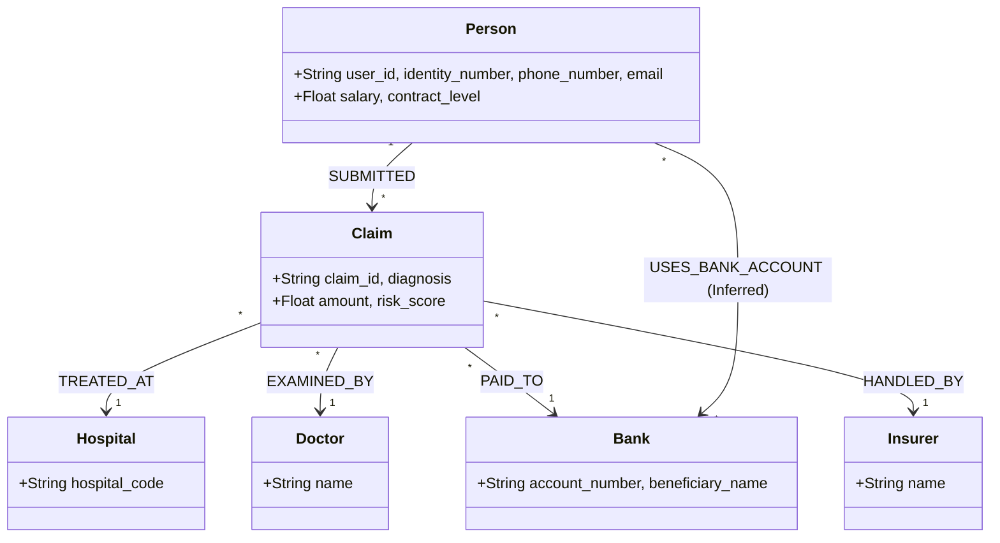

# Hướng dẫn Chuyên gia: Khai phá Mạng lưới Trục lợi Bảo hiểm Hệ thống (Master Graph Audit)

**Đối tượng:** Chuyên gia Neo4j / Chuyên gia Link Analysis
**Mục tiêu:** Thực hiện Deep Link Analysis để bóc tách các đường dây trục lợi có tổ chức (Organized Fraud).

---

## 1. Hướng dẫn Kết nối & Hạ tầng (Connection Guide)

Toàn bộ dữ liệu đã được nạp (Ingested) thành công vào Neo4j Local.

- **URI:** `neo4j://127.0.0.1:7687`
- **Username:** `neo4j`
- **Password:** `Chien@2022`
- **Database:** `neo4j`
- **Giao diện Trực quan:** Khuyến nghị dùng **Neo4j Bloom** để xem các cụm (Clusters) hoặc **Cypher Shell/Browser** cho truy vấn logic.
- **Index:** Đã đánh Index cho `user_id`, `claim_id`, `phone_number`, `email`.

---

## 2. Graph Ontology (Cấu trúc Đồ thị)

Chuyên gia cần nắm vững Schema này để xây dựng các truy vấn đa tầng:

---

## 3. Tổng kết các Phát hiện Đã biết (The "Evidence Registry")

Đây là các tảng băng chìm đã được AI phát hiện từ dữ liệu thô:

### A. Hạ tầng Trục lợi (Syndicates)
- **Financial Hub:** STK `00355868002` (Nguyễn Thị Tú Trinh) nhận tiền cho **182 khách hàng khác nhau**.
- **PII Hub:** Số ĐT `985048243` chung cho **80 người**. Email `huongd...` chung cho hàng chục người.
- **Agent Focus:** 100% hồ sơ rủi ro cao thuộc đại lý **Dương Văn Hoàng**.

### B. Hành vi Hệ thống (Patterns)
- **Medical Cloning:** 259 cụm bệnh án bị "Copy-Paste" nội dung diễn biến lâm sàng y hệt nhau (Vd: cụm Viêm mũi họng cho 806 người).
- **JIT Cluster:** 1.085 hồ sơ nộp ngay sau ngày 30 (vừa hết hạn chờ).
- **Waiting Period Violation:** 1.256 hồ sơ bệnh đặc biệt (Ung thư, Tim mạch) nộp sai quy định thời gian chờ.

---

## 4. Danh mục Quy tắc nghiệp vụ (AZINSU Audit Rules)

Chúng tôi cần chuyên gia chuyển hóa các quy tắc sau thành các câu lệnh Cypher:

- **Bất thường Điều trị:** Chẩn đoán nhẹ nhưng nằm viện dài (Vd: Viêm họng > 10 ngày).
- **Tần suất & Cụm Gia đình:** Nhiều thành viên trong một gia đình (cùng address/phone) khám liên tục tại cùng 1 phòng khám với cùng chẩn đoán.
- **Túi lọc Tuyến cơ sở:** Các hồ sơ lớn tại tuyến Xã/Phường, Bệnh xá ngành.
- **Trục lợi Nha khoa (Dental Splits):** Tách hồ sơ răng đơn giản thành nhiều đợt.
- **Bất thường về giá (Price Variance):** Cùng một loại thuốc/dịch vụ nhưng có đơn giá khác nhau giữa các bệnh nhân tại cùng một cơ sở (Vd: Người A mua thuốc X giá 10k, người B mua giá 20k).
- **Bất thường "Trung thành" CSYT (Facility Loyalty Anomaly):** Khám một bệnh vặt (viêm họng, cảm) quá 2 lần tại cùng 1 cơ sở mà không đổi nơi khác. Logic: Nếu 2 lần không thuyên giảm, người dùng thông thường sẽ đổi bên; việc ở lại mua thuốc liên tục là dấu hiệu "nuôi" hồ sơ hoặc thông đồng.
- **Trục lợi "Vụn" (Petty Fraud Multi-Visit):** Hồ sơ bệnh vặt có số tiền dưới 200k nhưng lặp lại quá 7 lần trong thời gian ngắn. Đây là hành vi lách quy định hóa đơn VAT và lợi dụng các ngưỡng duyệt tự động/nhanh.

---

## 5. Evidence-Base: Các Case Study lịch sử (Historical Ground Truth)

Dưới đây là các cấu trúc gian lận đã xác minh, Chuyên gia cần tìm các "phiên bản" tương tự trong dữ liệu mới:

### 5.1. Nhóm "Medic Gia Lai" (Fake Clinic Seals)
- **Hành vi:** Khám liên tục, chẩn đoán "Viêm mũi họng/Rối loạn tiêu hóa". 
- **Đặc điểm:** Hóa đơn luôn < 200.000 VNĐ (để không cần hóa đơn VAT). Đơn thuốc kê cho 2-3 ngày và trùng lặp.
- **Thực tế:** CSYT xác nhận dấu trên chứng từ là GIẢ.
- **Neo4j Target:** Tìm chuỗi `Claim` liên kết với cùng `Hospital` có mẫu chi phí "ngưỡng thấp" lặp lại dày đặc.

### 5.2. Cụm "Doctor Shopping" (Gom hồ sơ quy mô lớn)
- **Kịch bản:** Toàn bộ gia đình hoặc nhóm người quen gom hồ sơ tại một cơ sở.
- **Ví dụ điển hình:**
    - Phạm Ngọc Bảo Khang: 8 lần khám/tháng tại PK CHAC 2.
    - Cụm gia đình Tào Tuấn Anh: 2 con khám 10-11 lần/tháng tại PK Nhi đồng 315.
    - Trịnh Mộc Khả Doanh: 11 lần/tháng tại PK Nhi đồng 315.
- **Neo4j Target:** `(p:Person)-[:SUBMITTED]->(c:Claim)-[:TREATED_AT]->(h)`. Đếm Frequency theo `Person` và `Hospital`. Gắn cờ các cụm người dùng chung địa chỉ có `frequency > 5` lần/tháng.

### 5.3. Trục lợi Kỹ thuật cao (Nha khoa/Phẫu thuật)
- **Dental Inflation:** Trám 9-10 răng cùng lúc (Vd: Nha khoa An Định, Việt Pháp).
- **ACL Timing:** Đứt dây chằng chéo trước ngay sau khi mua bảo hiểm (Vd: Đào Thị Thao - BV 108).
- **Neo4j Target:** Lọc `Claim` có `amount` cao đột biến ngay sau `Person.policy_start_date`.

---

## 6. Directive: Các truy vấn Ưu tiên cho Chuyên gia

1. **Super-Syndicate Discovery:** Tìm các Node `Bank` hoặc `Phone` kết nối với các cụm người dùng có điểm `risk_score` trung bình > 7.
2. **Family Cluster Search:** `MATCH (p1:Person)-[:SUBMITTED]->(c1:Claim)-[:TREATED_AT]->(h), (p2:Person)-[:SUBMITTED]->(c2:Claim)-[:TREATED_AT]->(h) WHERE p1.address = p2.address AND p1 <> p2 ...`
3. **Ghost Clinic Detection:** Liệt kê các `Hospital` có tỷ lệ hóa đơn lẻ chiếm > 90% tổng số `Claim`.
4. **Price Consistency Audit:** Tìm các `Expense` cùng tên thuốc tại cùng `Hospital` nhưng có `unit_price` lệch nhau > 30%.
5. **Ineffective Treatment Trap:** Tìm các `Person` có > 2 `Claim` cùng `diagnosis` vặt tại cùng 1 `Hospital` trong vòng 15 ngày.
6. **Petty Claim Storm:** Lọc các `Person` có > 7 `Claim` mà `amount < 200000` VNĐ trong vòng 30 - 60 ngày.

---
**Ghi chú:** Chúng tôi cần xác định "AI-driven Masterminds" - những thực thể điều phối cuộc chơi đằng sau các cụm hồ sơ gia đình và nha khoa.
