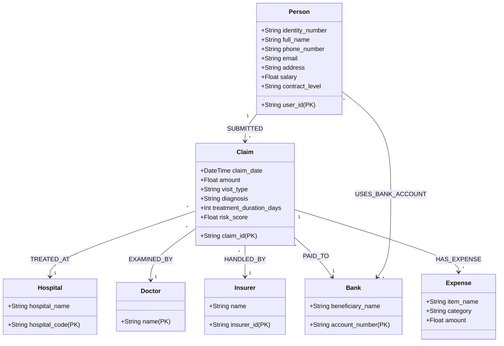

# Neo4j Graph Ontology: Final Fraud Architecture

Đây là sơ đồ Ontology cuối cùng được sử dụng để xây dựng Cơ sở dữ liệu Đồ thị (Knowledge Graph) phục vụ truy vết trục lợi.

## 1. Biểu đồ Ontology (Mermaid)

## 2. Chi tiết Thuộc tính quan trọng

| Node | Thuộc tính then chốt | Ý nghĩa trong Truy vết (Fraud Analysis) |
| :--- | :--- | :--- |
| **Person** | `contract_level`, `salary` | Phát hiện kịch bản "Nâng cấp gói trước khi bệnh nặng" và tính cân xứng thu nhập. |
| **Claim** | `risk_score` | Tổng hợp điểm rủi ro từ 5 lớp lọc AI để ưu tiên xử lý. |
| **Doctor** | `name` | Tìm kiếm mạng lưới bác sĩ có dấu hiệu thông đồng hoặc chẩn đoán ảo. |
| **Bank** | `account_number` | Điểm hội tụ của các nhóm trục lợi có tổ chức (Syndicates). |

## 3. Các kịch bản truy vết sẽ triển khai trên Graph
- **Mạng lưới PII:** Tìm khách hàng dùng chung Số điện thoại, Email hoặc STK Ngân hàng.
- **Vòng tròn Collusion:** Tìm mối liên hệ mật thiết giữa Đại lý (Insurer) - Bác sĩ - Bệnh viện có tỷ lệ từ chối claim cao.
- **Chuỗi sự kiện (Sequence Analysis):** Truy sát lịch sử thay đổi `contract_level` trước các `Claim` lớn.

---
**Trạng thái:** ONTOLOGY ĐÃ HOÀN THIỆN. Sẵn sàng cho quá trình Migration.
