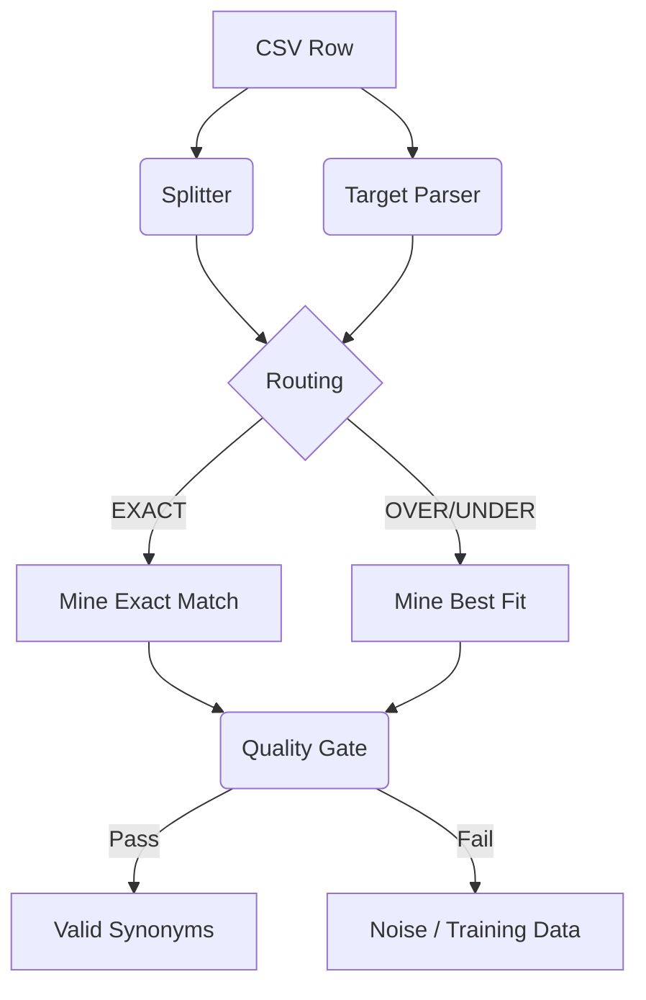

# Feedback Mining Pipeline Logic

*Processing Flow for `data-icd-feedback.csv`*

Đây là quy trình chi tiết về cách hệ thống xử lý từng dòng dữ liệu trong file CSV Feedback của bạn để trích xuất các cặp dữ liệu huấn luyện (Training Data).

## 1. Input Structure (Cấu trúc đầu vào)

Hệ thống đọc 3 cột chính từ file CSV:

* **`chan_doan`** (Input): Chuỗi chẩn đoán thô của bác sĩ. (VD: "Sốt xuất huyết Dengue ngày 4, Viêm họng").
* **`benh_chinh`** (Target 1): Mã ICD chính. (VD: "A97 - Sốt xuất huyết Dengue").
* **`benh_phu`** (Target 2): Chuỗi JSON chứa các mã ICD phụ. (VD: `{"id": "...", "ma": "J02", "ten": "Viêm họng cấp"}`).

---

## 2. Processing Steps (Các bước xử lý)

Mỗi dòng dữ liệu sẽ đi qua 5 bước xử lý tuần tự:

### Bước 1: Chuẩn hóa & Tách từ (Normalization & Splitting)

* **Input**: Cột `chan_doan`.
* **Logic**:
  * Chuyển về chữ thường (lowercase).
  * Bảo vệ các cụm từ đặc biệt (Ngày tháng, đơn vị đo, cụm từ ghép bằng dấu gạch ngang như "Tay-Chân-Miệng").
  * **Tách chuỗi (Split)** dựa trên các ký tự phân cách: `,`, `;`, `-` (trừ trường hợp bảo vệ), `+`, `/` (tùy ngữ cảnh), từ nối "và", "kèm theo".
* **Output**: Danh sách các "Chunks" (Mảnh chẩn đoán).
  * *Ví dụ*: `["sốt xuất huyết dengue ngày 4", "viêm họng"]`.

### Bước 2: Phân tích Đích (Target Parsing)

* **Input**: Cột `benh_chinh` và `benh_phu`.
* **Logic**:
  * Trích xuất Mã (Code) và Tên bệnh (Description) từ chuỗi văn bản.
  * Parse JSON từ `benh_phu` để lấy danh sách mã phụ.
* **Output**: Danh sách các "Targets" (Mục tiêu ICD).
  * *Ví dụ*: `[{"code": "A97", "desc": "Sốt xuất huyết Dengue"}, {"code": "J02", "desc": "Viêm họng cấp"}]`.

### Bước 3: Định tuyến (Routing)

So sánh số lượng **Chunks** (Input) và **Targets** (Output) để phân loại bản ghi:

* **EXACT**: Số lượng bằng nhau (1 Chunk - 1 Target, hoặc N - N). Lý tưởng để map 1-1.
* **OVER**: Nhiều Chunks hơn Targets (Bác sĩ chẩn đoán chi tiết hơn ICD ghi nhận). Cần tìm cái nào khớp nhất.
* **UNDER**: Ít Chunks hơn Targets (Một câu chẩn đoán gộp nhiều bệnh). Khó xử lý hơn.

### Bước 4: Khai thác & Gióng hàng (Mining & Alignment)

Hệ thống cố gắng ghép từng **Chunk** với **Target** phù hợp nhất dựa trên độ tương đồng văn bản (Text Similarity):

* Tính điểm Similarity (0.0 - 1.0) giữa mỗi Chunk và tất cả Targets.
* Chọn cặp có điểm cao nhất.
* **Output**: Các cặp đề xuất `(Chunk gốc) -> (ICD Đích)`.

### Bước 5: Kiểm tra chất lượng (Quality Gate)

Lọc lại các cặp đã ghép ở Bước 4 với **Ngưỡng tùy theo Category**:

| Category             | Ngưỡng (Threshold) | Lý do                                                               |
| -------------------- | -------------------- | -------------------------------------------------------------------- |
| **EXACT**      | **0.35**       | Cấu trúc đã khớp 1-1, chỉ cần độ tương đồng tối thiểu |
| **OVER/UNDER** | **0.50**       | Cấu trúc lệch, cần chặt hơn để tránh ghép sai              |

1. **Threshold Check**: Nếu điểm Similarity < ngưỡng tương ứng -> Đánh dấu là **Low Confidence** (Cần người review hoặc cần Embedding để học).
2. **Logic Check**: Kiểm tra quy tắc cấm (Blacklist). Ví dụ: Input có từ "Trái" (Left) nhưng Code lại là "Phải" (Right) -> Loại bỏ ngay lập tức.

---

## 3. Output (Kết quả đầu ra)

Kết quả cuối cùng được chia làm 2 nhóm để hiển thị trên UI:

1. **Valid Pairs (Hợp lệ)**: Các cặp có điểm cao và logic đúng.
   * *Dùng để*: Tự động đưa vào Qdrant (nếu bật chế độ Auto-Ingest) làm dữ liệu tìm kiếm.
2. **Noise/Review Needed (Nhiễu/Cần xem xét)**: Các cặp điểm thấp hoặc bị loại bỏ.
   * *Dùng để*: Người quản trị xem lại, cập nhật từ điển từ đồng nghĩa, hoặc huấn luyện lại Model.

---

## 4. Vector Embedding & Ingestion (Vectơ hóa & Lưu trữ)

Bước cuối cùng của chu kỳ Feedback Pipeline là đưa tri thức mới vào Vector Database.

1. **AI Embedding**:
   * Các cặp **Valid Pairs** sẽ được gửi đến Azure OpenAI (`text-embedding-3-small` hoặc `text-embedding-ada-002`).
   * Chuỗi văn bản `chunk` được chuyển thành Vector 1536 chiều (dimension).
2. **Lưu trữ Qdrant**:
   * Vector được Upsert vào Collection `icd_full_kb` (hoặc collection cấu hình).
   * **Payload** đi kèm bao gồm:
     * `icd_code`: Mã ICD tương ứng.
     * `text`: Nội dung chẩn đoán thô đã tách.
     * `source`: `mined_feedback_auto_pipeline` (Để phân biệt với dữ liệu gốc).
     * `original_score`: Điểm similarity lúc Mining.
3. **Tác dụng**:
   * Ngay sau khi Ingest, hệ thống Search sẽ có thể tìm thấy mã ICD này thông qua các từ khóa mới (từ đồng nghĩa) mà trước đó chưa có trong bộ quy tắc.

---

## Sơ đồ luồng dữ liệu

