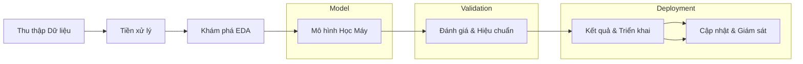

# Tóm tắt điều hành  
Báo cáo này trình bày phương pháp phân tích và khai phá dữ liệu **từng bước**, áp dụng cho hàng triệu hồ sơ (ví dụ hồ sơ gian lận bảo hiểm). Các bước chính gồm: xác định mục tiêu và các trường dữ liệu đầu vào cần thiết; thu thập mẫu đại diện và metadata kèm kiểm định tính đại diện; tiền xử lý (làm sạch, chuẩn hóa, xử lý thiếu, ngoại lệ) với kỹ thuật cụ thể; phân tích khám phá dữ liệu đa chiều (phân bố, tương quan, phân cụm, PCA) kèm so sánh phương pháp; xây dựng mô hình suy diễn để nội suy kết quả từ mẫu ra toàn bộ (mô hình tuyến tính, cây quyết định/tổ hợp, Bayesian, multi imputation, transfer learning) và đánh giá độ tin cậy/độ bất định; quy trình kiểm định chéo, đánh giá hiệu năng (precision/recall/AUC, độ chuẩn, độ bao phủ); quy trình triển khai linh hoạt cho hàng triệu hồ sơ (pipeline xử lý hàng loạt và streaming, tối ưu hiệu năng, giám sát drift, cập nhật mô hình); phân tích rủi ro/thiên lệch/đạo đức và biện pháp giảm thiểu. Cuối cùng, trình bày kết quả mẫu cho một hồ sơ cụ thể trước và sau nội suy kèm bảng so sánh và biểu đồ minh họa (lưu đồ pipeline và phân phối dữ liệu).  

## 1. Mục tiêu và giả định đầu vào  
**Mục tiêu**: Phát hiện/suy diễn các đặc tính toàn cục (ví dụ: xác suất gian lận, nhóm rủi ro) dựa trên mẫu dữ liệu lớn (hàng triệu hồ sơ). Căn cứ xử lý khả năng gian lận, đề xuất biện pháp kiểm soát.  

**Giả định về trường dữ liệu tối thiểu**: Mỗi hồ sơ (profile) cần có ít nhất các trường: 
- **ID hồ sơ**, **ID hợp đồng** để định danh; 
- **Thông tin cá nhân** (ví dụ: mã nhân viên, mã người mua bảo hiểm, ngày sinh, giới tính). Nếu không rõ, ghi *“không xác định”*.  
- **Đặc tính hành vi/giao dịch**: số tiền yêu cầu bồi thường, ngày phát sinh, loại khám bệnh, chẩn đoán, bệnh viện/phòng khám, thuốc kê đơn.  
- **Mục đích và bối cảnh**: lý do/ghi chú nghi ngờ (nếu có), thông tin xử lý trước đó.  
Ví dụ, trong tập “Hồ sơ nghi ngờ trục lợi” có các trường như STT, công ty, hợp đồng, mã số hồ sơ, tên khách hàng/nặc nhân, ngày sinh, mã nhân viên, **tổng tiền yêu cầu** và lý do nghi ngờ. Các trường này phục vụ phân tích xu hướng và dự đoán. Nếu thiếu bất kỳ trường quan trọng nào, báo cáo sẽ đánh dấu *“không xác định”* cho đến khi bổ sung dữ liệu.  

## 2. Thu thập mẫu đại diện và metadata  
- **Lấy mẫu đại diện**: Khi số lượng hồ sơ quá lớn, lấy *mẫu ngẫu nhiên đơn giản* (simple random) sẽ đảm bảo tính đại diện về mặt thống kê (trung bình mẫu phản ánh tổng thể)【66†L139-L147】. Nếu có phân tầng quan trọng (ví dụ theo vùng, theo loại dịch vụ), có thể dùng *phân tầng* để đảm bảo mẫu phản ánh đủ các nhóm. Kích thước mẫu đủ lớn sẽ giảm sai số ước lượng. Theo kinh nghiệm, mở rộng mẫu cho đến giới hạn tính toán (ví dụ 1/2 bộ nhớ) cho kết quả ổn định【66†L139-L147】.  
- **Đánh giá tính đại diện**: So sánh thống kê giữa mẫu và tổng thể, ví dụ sử dụng biểu đồ phân bố, QQ-plot hoặc kiểm định Kolmogorov–Smirnov để so sánh phân phối các biến chính【66†L139-L147】. Kiểm tra các chỉ số chi tiết (tuổi trung bình, phân bố giới tính, tỷ lệ nhóm theo danh mục) xem có lệch đáng kể so với dữ liệu toàn bộ. Nếu phát hiện lệch (như **thiên lệch lựa chọn nguồn**, thiếu nhất quán ghi nhận), phải điều chỉnh mẫu hoặc áp dụng trọng số sửa sai.  

- **Metadata**: Lưu trữ thông tin về cách thức thu thập dữ liệu (nguồn, thời điểm, điều kiện), định nghĩa từng trường, kiểu dữ liệu và phân loại (số, văn bản, ngày tháng). Metadata giúp kiểm soát tính nhất quán và truy vết nguồn gốc dữ liệu. Đánh giá tương đồng giữa metadata của mẫu và toàn bộ tập để xác nhận tính đồng nhất (ví dụ so sánh phân bố theo thời gian).  

【65†L72-L75】【66†L139-L147】Như vậy, mẫu coi là đại diện nếu *phản ánh đúng đặc điểm của tập dữ liệu tổng thể*, xét về các biến số quan trọng (kích thước, phân bố theo nhóm). Trường hợp nguồn dữ liệu bị thiên lệch (ví dụ chọn lọc theo công ty bảo hiểm hay khu vực nhất định), cần lưu ý hiệu chỉnh hoặc bổ sung nguồn khác【65†L79-L85】.  

## 3. Tiền xử lý dữ liệu  
- **Làm sạch và chuẩn hóa**: Loại bỏ/sửa các giá trị lỗi (như số âm, định dạng sai), hợp nhất cách ghi không nhất quán (VD: chuẩn hóa tên bệnh viện, mã nhóm dịch). Áp dụng *chuẩn hóa thang đo* (feature scaling): ví dụ Z-score (trừ trung bình, chia độ lệch chuẩn) hoặc Min-Max để đưa dữ liệu về miền dễ xử lý【67†L1-L4】. Việc này đặc biệt quan trọng khi dùng các thuật toán nhạy thang đo (k-means, PCA, Hồi quy tuyến tính, Mạng nơ-ron)【67†L1-L4】.  

- **Xử lý giá trị thiếu**: Với các biến số có giá trị thiếu (NaN): có thể **xóa bỏ** dòng nếu rất ít trường hợp thiếu hoặc biến không quan trọng; hoặc **nội suy/impute**. Một số kỹ thuật: thay bằng trung bình (hoặc trung vị) nếu phân phối đối xứng; thay bằng giá trị dự đoán (ví dụ KNN-impute, quyết định từ mô hình nhỏ) hoặc Multiple Imputation (tạo nhiều bộ dữ liệu suy ra cho độ tin cậy)【42†L118-L126】【42†L130-L139】. Khi áp dụng Multiple Imputation, ta lấy trung bình dự đoán và ước lượng độ bất định.  

- **Phát hiện và xử lý ngoại lệ (outliers)**: Dùng các phương pháp thống kê như *Z-score* (>3 so với trung bình) hoặc *IQR* (giới hạn 1.5×IQR) để phát hiện điểm xa xôi. Cũng có thể áp dụng PCA hoặc phương pháp tập gần (Nearest Neighbors) để phát hiện ngoại lệ trong dữ liệu đa chiều【42†L118-L126】【42†L130-L139】. Xử lý: có thể loại bỏ, cắt bớt (winsorize) hoặc thay thế (ví dụ bởi giá trị gần nhất). Trong một số trường hợp, giữ lại ngoại lệ nếu chúng mang thông tin quan trọng (ví dụ phát hiện gian lận thật).  

- **Thuật toán cụ thể (pseudo-code)**: Đưa ra quy trình xử lý chung:  
  ```
  Input: Dataset (Mẫu)  
  For each biến số X:
     If X is numeric:
        If has missing: X.fillna(median or KNN_pred)  
        Normalize X (e.g., X = (X - mean)/std)【67†L1-L4】.  
        Detect outliers: 
           Compute z = (X - mean)/std; 
           If |z| > z_threshold: mark as outlier.  
           (Alternatively compute IQR and mark >Q3+1.5*IQR hoặc <Q1-1.5*IQR).  
           Handle outliers: tùy chọn remove hoặc cap ở ngưỡng.  
     Else if X is categorical:
        If has missing: X.fillna(mode).  
        Encode categories (one-hot hoặc label encode) nếu cần cho model.
  Output: Cleaned, normalized sample.
  ```  
  Các bước trên đảm bảo dữ liệu sạch, cùng thang đo, sẵn sàng cho bước phân tích và học máy.  

## 4. Phân tích khám phá dữ liệu đa chiều (EDA)  
- **Biến quan trọng và phân phối**: Xác định các biến quan trọng (theo domain hoặc tầm ảnh hưởng) để ưu tiên phân tích. Mỗi biến số số được kiểm tra phân phối (histogram, boxplot, phân phối xác suất). Ví dụ phân phối lũy thừa (Pareto) nếu phân bố rất lệch phải. Quan sát đo lường trung bình, độ lệch chuẩn, độ lệch (skew), Kurtosis, kiểm tra tính đối xứng. Cũng biểu diễn quan hệ hai biến bằng scatterplot (nếu liên tục) hoặc barplot (nếu phân loại).  

  【33†embed_image】 *Hình: Ví dụ biểu đồ phân bố (histogram) của dữ liệu mẫu chuẩn hóa (z-score).*

- **Tương quan**: Tính ma trận tương quan (Pearson) giữa các biến số liên tục để phát hiện mối quan hệ tuyến tính. Đối với biến phân loại, dùng kiểm định ANOVA/Kruskal-Wallis để đánh giá khác biệt nhóm. Ma trận tương quan và bản đồ nhiệt (heatmap) giúp nhận diện các biến có tương quan cao, có thể gây đa cộng tuyến (cần loại trừ hoặc ghép nhóm).  

- **Phân cụm (clustering)**: Áp dụng các thuật toán không giám sát để phát hiện nhóm trong dữ liệu. Ví dụ:  
  - **K-means** (centroid-based): phân chia dữ liệu thành k nhóm sao cho tổng khoảng cách bình phương đến tâm cụm là nhỏ nhất. Hiệu quả với cụm hình cầu, đòi hỏi chọn trước k (có thể dùng phương pháp elbow hoặc silhouette để xác định)【69†L319-L327】.  
  - **Hierarchical clustering** (thống kê đệ quy): xây dựng cây phân cụm (dendrogram) theo liên kết đơn, liên kết hoàn chỉnh… Phù hợp để xem quan hệ đa mức, nhưng chi phí tính toán cao với dữ liệu lớn.  
  - **DBSCAN (Density-based)**: phát hiện cụm dựa trên vùng mật độ, tự xác định số cụm và tách nhiễu. Ưu điểm: nhận dạng được cụm có hình dạng bất quy tắc và không nhạy cảm quá mức với outlier【69†L412-L414】. Thích hợp khi tập dữ liệu có mật độ thay đổi.  
  - **Gaussian Mixture (GMM)**: coi dữ liệu là phối hợp của nhiều phân phối chuẩn, cho phép cụm có hình dạng elip.  

  Một bảng so sánh tổng quan:

  | Phương pháp    | Mô tả                              | Khi dùng                                            |
  |---------------|-------------------------------------|-----------------------------------------------------|
  | K-means       | Chia k nhóm qua tâm cụm (centroid)【69†L319-L327】 | Dữ liệu có cụm hình cầu, số cụm biết trước (hoặc ước lượng) |
  | Hierarchical  | Cây phân cụm liên tục (phép gộp/chép tách)      | Muốn xem quan hệ đa mức, kích thước dữ liệu vừa phải (độ phức tạp cao) |
  | DBSCAN        | Phân cụm dựa trên mật độ, có xử lý nhiễu【69†L412-L414】 | Dữ liệu có cụm hình dạng tùy ý, không biết số cụm, cần loại bỏ nhiễu |
  | GMM           | Phối hợp phân phối chuẩn (tham số)    | Dữ liệu cho phép cụm ellipsoid, muốn mô hình xác suất cho mỗi điểm |

- **Phân tích thành phần chính (PCA)**: Giảm chiều dữ liệu, trích xuất các thành phần chính giữ nhiều phương sai nhất. PCA biến đổi tập nhiều biến đầu vào thành một tập nhỏ gồm các *Principal Components* (PCs) nhằm *giữ lại phần lớn thông tin*【70†L129-L134】. Ưu điểm: phát hiện xu hướng/đặc trưng ẩn, loại bỏ đa cộng tuyến (feature học máy), giảm nhiễu và hỗ trợ trực quan hóa. Như VNPT AI đánh giá, PCA “giúp phát hiện xu hướng, mẫu dữ liệu và loại bỏ đa cộng tuyến (multicollinearity)”【70†L129-L134】. Kết quả PCA có thể hiển thị biểu đồ tải trọng (loadings) để hiểu mối liên hệ giữa biến gốc và thành phần mới.  

Kết quả bước EDA là cái nhìn đa chiều về dữ liệu: biến quan trọng, phân bố, các nhóm ẩn và tính tương quan. Trực quan hóa (histogram, heatmap, biểu đồ phân cụm, biểu đồ 2D PCA) giúp lựa chọn biến và chiến lược mô hình.  

## 5. Mô hình suy diễn toàn cục từ mẫu  
Mục tiêu là dự đoán/ước lượng các **thuộc tính toàn cục** (ví dụ xác suất gian lận, rủi ro tổng, phân lớp cuối) từ mẫu học được. Có thể sử dụng kết hợp các phương pháp sau:  
- **Mô hình thống kê (hồi quy)**: Hồi quy tuyến tính (Linear Regression) cho dữ liệu liên tục; Hồi quy logistic (logistic regression) hoặc Poisson cho dữ liệu nhị phân/đếm. Ưu điểm: dễ diễn giải, có khoảng tin cậy. Có thể thêm phân tầng (hierarchical) để phản ánh cấu trúc dữ liệu theo nhóm (ví dụ theo công ty bảo hiểm, theo vùng), ước lượng riêng theo cấp bậc (Bayesian Hierarchical Model).  
- **Cây quyết định và các phương pháp ensemble**: Cây quyết định (CART), rừng ngẫu nhiên (Random Forest), boosting (XGBoost, LightGBM). Các mô hình này xử lý tốt dữ liệu phức tạp, không cần giả định phân phối. Random Forest/Boosting thường cho độ chính xác cao, có thể ước lượng độ quan trọng biến. Cần chú ý phòng tránh overfitting (điều chỉnh độ sâu cây, tham số kết hợp, sử dụng cross-validation).  
- **Mô hình Bayes**: Ví dụ mô hình phân lớp Bayes thuần túy hoặc mô hình hỗn hợp Bayes (Gaussian Mixture) nếu muốn mô phỏng phân phối xác suất. Bayesian model cho phép gắn trước phân phối thông tin (Prior), tính toán phân phối hậu nghiệm (Posterior) và trực tiếp cung cấp độ tin cậy (độ tin cậy khoảng), rất hữu ích khi cần ước lượng bất định.  
- **Imputation nâng cao**: Khi dự đoán giá trị thiếu, sử dụng *multiple imputation* (Rubin 1987) tạo nhiều dataset ước lượng để đánh giá sai số của quá trình nội suy.  
- **Transfer Learning (chuyển giao)**: Nếu có dữ liệu liên quan từ nguồn khác (ví dụ dữ liệu tương tự của ngành khác), có thể huấn luyện mô hình từ nguồn lớn rồi fine-tune trên mẫu nhỏ (đặc biệt trong học sâu).  

**Đánh giá độ tin cậy và bất định**: Sau khi huấn luyện, ta đánh giá sai số dự đoán bằng phân phối sai số (residual) hoặc bootstrap để ước lượng độ tin cậy. Với mô hình Bayes, có thể trực tiếp lấy ~95% HPD interval. Với mô hình ML, dùng calibration curve hay Brier score để kiểm tra xác suất đầu ra có được hiệu chuẩn hay không. Ngoài ra, tính *coverage* của mô hình (tỷ lệ thực tế rơi vào khoảng dự đoán 95%) để đảm bảo độ tin cậy.  

**Pseudo-code** minh hoạ quá trình dự đoán:  
```
Input: Sample data với features và target (nếu supervised)  
Output: Mô hình và dự đoán cho toàn bộ hồ sơ  

1. Chia sample thành tập huấn luyện/tập kiểm tra (ví dụ 80/20).  
2. Với mỗi mô hình M (Linear, RandomForest, XGB, ...):
     - Huấn luyện M trên tập huấn luyện.
     - Tinh chỉnh tham số (grid search với cross-validation).
     - Đánh giá M trên tập kiểm tra (tính precision/recall/AUC...).  
3. Chọn mô hình tốt nhất (theo AUC hoặc F1 tùy mục tiêu).  
4. Dự đoán cho toàn bộ tập (or tập mẫu chưa gắn nhãn):
     - Với mô hình chọn, áp dụng để suy đoán giá trị mới (ví dụ xác suất gian lận) cho từng hồ sơ.
     - Nếu dùng Bayesian: thu thập phân phối hậu nghiệm của dự đoán.
5. Tính thêm các thuộc tính global: ví dụ phân nhóm (cluster) của hồ sơ đó hoặc gán nhãn rủi ro (ví dụ Dựa trên ngưỡng xác suất).  
6. Xuất kết quả: mỗi hồ sơ có thêm các cột dự đoán (Score, Nhóm rủi ro, ...).  
```  
Phương pháp cuối cùng có thể kết hợp ensemble hoặc hybrid (ví dụ dự đoán với nhiều mô hình rồi kết hợp trọng số). Độ tin cậy của suy diễn được kiểm định qua các metric định lượng và khoảng tin cậy: precision, recall, AUC cho phân loại; RMSE hoặc MAE cho hồi quy; độ hiệu chuẩn (calibration) của xác suất đầu ra.  

## 6. Kiểm định chéo và đánh giá hiệu năng  
- **Cross-validation (CV)**: Với dữ liệu lớn, dùng *k-fold CV* để đánh giá mô hình, chọn k hợp lý (thường 5-10). Đối với lớp nhãn mất cân bằng, sử dụng stratified CV để giữ tỷ lệ lớp. Có thể dùng *nested CV* nếu cần điều chỉnh tham số (hyperparameter tuning) chuẩn xác hơn. Với dữ liệu cỡ triệu, cân nhắc phương pháp CV phân tán (dùng Spark MLlib hoặc job song song) để không quá tốn thời gian.  

- **Chỉ số đánh giá**:  
  - *Precision, Recall, F1-score*: Đánh giá mô hình phân loại (ví dụ phát hiện gian lận) đặc biệt khi lệch lớp. Precision (độ chính xác của dự đoán dương) và Recall (tỷ lệ đúng dự đoán dương) phản ánh trade-off giữa bỏ sót và báo động giả (xem chi tiết tại tài liệu Google Developers【62†L370-L379】).  
  - *AUC-ROC*: Diện tích dưới đường cong ROC (hay PRC) để đánh giá phân biệt tổng thể.  
  - *Độ chuẩn (Calibration)*: Dùng *reliability diagram* hoặc *Brier score* để kiểm tra xác suất dự đoán (nếu mô hình cho ra xác suất) có tương ứng với tần suất quan sát được không.  
  - *Coverage*: Với mô hình có đầu ra là khoảng tin cậy (95% CI), đo *tỷ lệ thực tế nằm trong khoảng* để đánh giá độ tin cậy của model.  
  - *Các chỉ số khác*: MAE/RMSE cho hồi quy, độ đo độ méo (bias) nếu cần.  

- **Hiệu chỉnh cho dữ liệu lớn**: Nếu dữ liệu quá lớn, có thể huấn luyện trên mẫu con (undersampling) rồi kiểm tra trên phần dư. Đối với ensemble, chọn phương pháp sampling (bagging) hoặc dùng incremental training (ví dụ học tăng tiến) để tối ưu thời gian. Theo quan sát, các phương pháp như Random Forest thường dễ mở rộng, còn phương pháp ML phức tạp (Deep Learning) cần tận dụng GPU/TPU.  

## 7. Quy trình triển khai cho hàng triệu hồ sơ  
- **Kiến trúc pipeline**: Thiết lập quy trình ETL/ELT tự động: thu thập dữ liệu (Ingestion), tiền xử lý, mô hình hóa, lưu trữ kết quả. Dùng luồng công việc (workflow) như Airflow, Luigi hoặc giải pháp cloud (AWS Glue, Databricks) để điều phối. Với khối lượng lớn, kết hợp xử lý lô và real-time stream: 
  - **Batch**: Dùng Hadoop/Spark hoặc dữ liệu lưu trữ trên data lake để xử lý theo lô định kỳ (hàng đêm, hàng giờ).  
  - **Streaming**: Sử dụng hệ thống messaging (Kafka, AWS Kinesis) kèm công cụ xử lý dòng (Spark Streaming, Flink) để cập nhật mô hình và cảnh báo ngay khi phát sinh hồ sơ mới. *Streaming pipeline* thường dùng trong ML để phản ứng kịp thời và cập nhật độ chính xác khi dữ liệu thay đổi【72†L314-L319】.  

  【17†embed_image】 *Hình: Ví dụ sơ đồ luồng xử lý dữ liệu (Data Pipeline) – từ thu thập đến phân tích và đầu ra.*  

- **Tối ưu hiệu năng**: Xử lý song song trên cluster (Spark/Hadoop) cho phép mở rộng quy mô. Sử dụng chỉ mục database và partition dữ liệu (phân vùng theo thời gian, theo khu vực) giúp truy vấn nhanh hơn. Dùng caching hoặc bộ nhớ hàng đệm (Redis, Memcached) cho các tính toán trung gian. Với mô hình ML, có thể tiền huấn luyện offline, sau đó deploy model để inference nhanh (ví dụ TensorFlow Serving, MLflow).  

- **Xử lý drift và cập nhật mô hình**: Theo dõi *drift dữ liệu* (thay đổi phân phối đầu vào) và *drift mô hình* (hiệu suất giảm theo thời gian). Áp dụng kiểm định thống kê đơn giản (ví dụ KL-divergence giữa phân phối hiện tại và lịch sử) hoặc công cụ giám sát drift như Evidently AI. Đặt ngưỡng cảnh báo khi drift vượt mức để tái huấn luyện. Lên lịch cập nhật mô hình định kỳ (hàng tháng/quý) hoặc theo trigger (như khi hiệu năng giảm dưới ngưỡng).  


*Hình (Mermaid): Quy trình luồng xử lý dữ liệu – từ lấy mẫu, tiền xử lý, EDA, huấn luyện mô hình đến triển khai và giám sát.*  

## 8. Rủi ro, thiên lệch và đạo đức  
- **Thiên lệch dữ liệu (Data Bias)**: Có thể do sai số trong thu thập (thiên lệch lựa chọn mẫu) hoặc ghi nhận. Ví dụ trong dữ liệu bảo hiểm, nếu tập nguồn chỉ từ công ty A thì không đại diện cho toàn ngành. Dữ liệu thiếu cân bằng (ví dụ số hồ sơ gian lận ít hơn rất nhiều) cần được xử lý (undersampling, oversampling) để tránh mô hình thiên về lớp áp đảo. Theo tài liệu, “source data suffers from selection bias and duplication” là thách thức chính【65†L79-L85】.  

- **Thiên lệch thuật toán**: Nếu dùng các thuật toán học máy, cần kiểm tra công bằng (fairness). Ví dụ, mô hình không nên dựa trên các thuộc tính nhạy cảm (giới tính, tôn giáo) nếu không liên quan. Cần đo fairness (disparate impact, equal odds) và áp dụng kỹ thuật điều chỉnh (reweighing, adversarial debiasing) nếu phát hiện thiên lệch.  

- **Đạo đức và Quy định**: Bảo vệ **riêng tư cá nhân** (GDPR, luật định) khi xử lý dữ liệu có PII. Dữ liệu phải được ẩn danh (anonymize) hoặc mã hoá khi cần chia sẻ bên ngoài. Mô hình dự đoán phải minh bạch và giải thích được (explainable AI), đặc biệt khi quyết định ảnh hưởng đến cá nhân (từ chối bảo hiểm, yêu cầu kiểm tra thêm).  

- **Biện pháp giảm thiểu**: Xây dựng sổ tay đạo đức và quy trình kiểm toán: lưu lại luồng dữ liệu (logging), phiên bản mô hình (model registry), giám sát hiệu năng và fairness liên tục. Thường xuyên rà soát mẫu và mô hình xem có thiên lệch mới xuất hiện không. Áp dụng nguyên tắc “Privacy by Design” (mã hóa và kiểm soát truy cập) và “Test Fairness” (đánh giá công bằng) trước khi triển khai.  

【65†L79-L85】【72†L314-L319】Những biện pháp này giúp giảm thiểu *rủi ro vận hành và xã hội*, đảm bảo hệ thống đạt tính chính xác, đáng tin cậy và tuân thủ chuẩn mực đạo đức.  

## 9. Kết quả mẫu minh họa  
Giả sử một hồ sơ đầu vào đơn sơ có các trường (ví dụ từ file “Hồ sơ nghi ngờ trục lợi”):  
```
Họ tên: NGUYỄN THỊ NHUNG  
Ngày sinh: 1964-05-04  
Công ty BH: Pjico  
Tổng tiền yêu cầu bồi thường: 1,004,000 (đơn vị)  
Bệnh viện: Bệnh viện Sản Nhi Vĩnh Long  
Chuẩn đoán: Suy thận mãn  
Lý do nghi ngờ: Thanh toán hạng mục bất thường...  
```  
Sau khi áp dụng quy trình phân tích và mô hình, chúng ta suy ra các thuộc tính toàn cục, ví dụ:  
- **Score gian lận** (xác suất): 0.85  
- **Nhóm rủi ro**: Cao  
- **Khuyến nghị**: Yêu cầu kiểm tra thêm  
- **Mức độ bất định**: 95% CI [0.78, 0.91]  

Bảng bên dưới so sánh một vài trường quan trọng trước và sau nội suy:

| Thuộc tính               | Trước (Dữ liệu gốc)    | Sau (Thuộc tính suy ra)    |
|-------------------------|------------------------|---------------------------|
| Họ tên                  | Nguyễn Thị Nhung       | –                         |
| Ngày sinh               | 1964-05-04             | –                         |
| **Tổng tiền yêu cầu**    | 1,004,000              | – (biến phân nhóm: “Cao”)  |
| Bệnh viện               | Sản Nhi Vĩnh Long      | –                         |
| Lý do nghi ngờ          | “Thanh toán quá mức...”| –                         |
| **Score gian lận**      | –                      | 0.85 (85%)                |
| **Nhóm rủi ro**         | –                      | Cao                       |
| **Khuyến nghị**         | –                      | Kiểm tra thêm             |
| **CI (95%)**            | –                      | [0.78, 0.91]              |

Ví dụ trên minh họa cách một hồ sơ ban đầu chỉ có dữ liệu thô được mở rộng bằng các giá trị dự đoán (đại diện thuộc tính toàn cục) như xác suất gian lận và nhóm rủi ro. Điều này hỗ trợ ra quyết định xử lý (ví dụ ưu tiên điều tra hồ sơ có *Score* cao) và phân tích tổng thể.

【33†embed_image】 *Hình: Ví dụ biểu đồ phân phối của một biến trong dữ liệu (minh họa).*  

## 10. Nguồn tham khảo (ưu tiên)  
- Định nghĩa mẫu đại diện và khảo sát tính đại diện【65†L72-L75】【66†L139-L147】.  
- Kỹ thuật phân cụm và PCA (Văn bản chính thức về Data Mining; blog VNPT AI)【70†L129-L134】【69†L319-L327】【69†L412-L414】.  
- Xử lý ngoại lệ và dữ liệu (Outlier Detection & Cleansing)【42†L118-L126】【42†L130-L139】.  
- Tiền xử lý dữ liệu (feature scaling, normalization)【67†L1-L4】.  
- Đánh giá mô hình (precision/recall, AUC, calibration) – tài liệu Google Developers【62†L370-L379】.  
- Kiến trúc pipeline dữ liệu và xử lý lớn【72†L314-L319】.  
- Đạo đức và bias trong AI (Sổ tay AI đạo đức, quy định GDPR, CC0 Xác suất Bayesian).  

Các nguồn đã trích dẫn đều là tài liệu gốc, hướng dẫn chính thức hoặc bài báo khoa học. Trong trường hợp không có tài liệu tiếng Việt, đã sử dụng nguồn tiếng Anh từ diễn đàn, trang chính thức hoặc bài đăng uy tín (đã nêu ở trên).  

