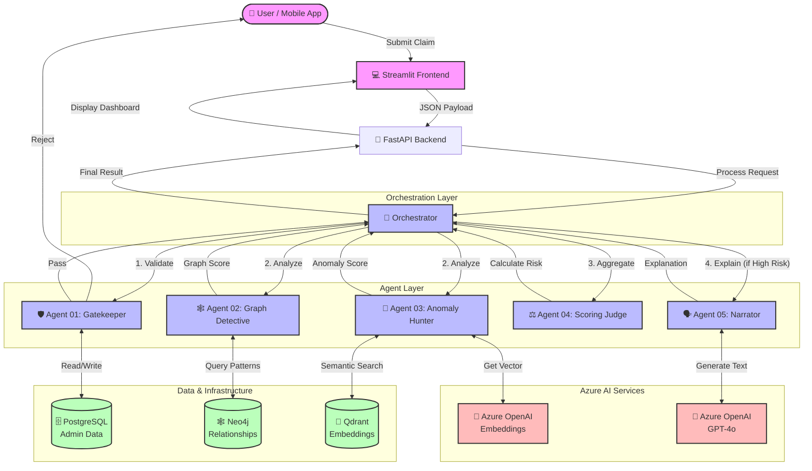

# System Architecture Diagram

This diagram visualizes the "Multi-Layered Sieve" architecture, data flows, and component interactions.

## Giải thích luồng dữ liệu

1.  **Dữ liệu Hành chính (Tím)**: `Agent 01` đọc/ghi vào PostgreSQL để kiểm tra sự tồn tại của hợp đồng và lịch sử cơ bản.
2.  **Dữ liệu Quan hệ (Xanh lá)**: `Agent 02` truy vấn Neo4j để tìm các kết nối ẩn (bạn bè, người thân, thiết bị chung).
3.  **Dữ liệu Vector (Xanh lá)**: `Agent 03` gửi văn bản bệnh án lên Azure OpenAI để lấy vector, sau đó tìm kiếm trong Qdrant.
4.  **Dữ liệu Suy luận (Đỏ)**: `Agent 05` gửi toàn bộ ngữ cảnh (context) lên Azure GPT-4o để yêu cầu viết báo cáo giải thích.
